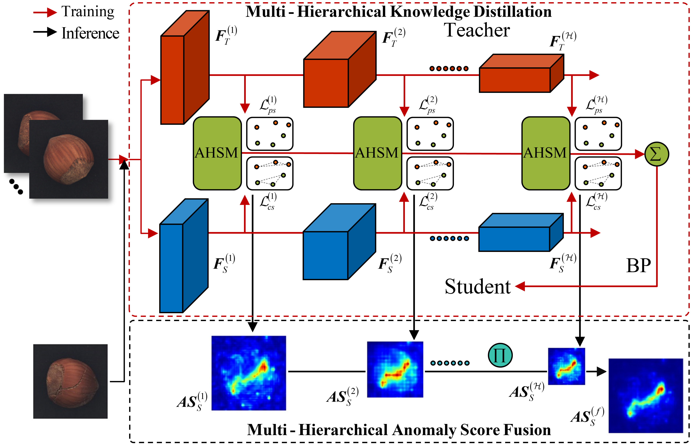
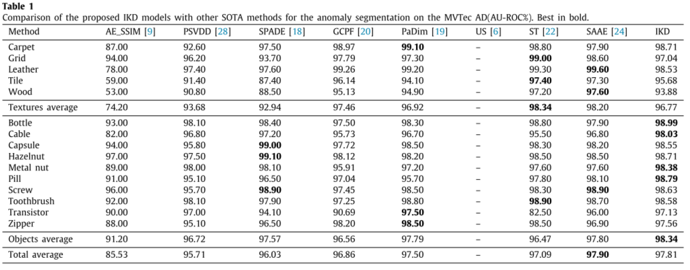
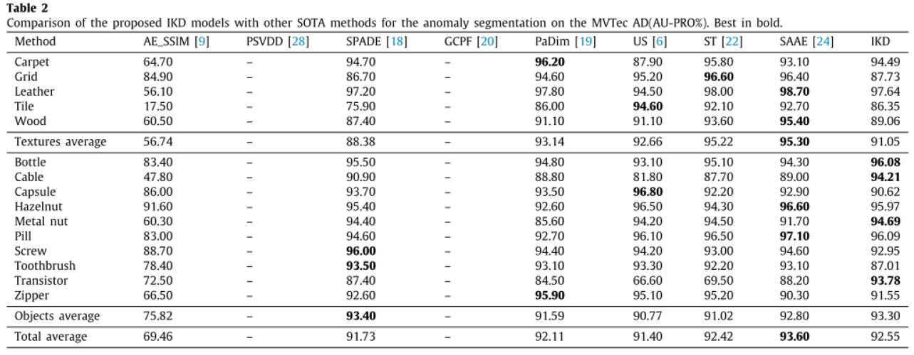

[](https://paperswithcode.com/paper/informative-knowledge-distillation-for-image)

## Informative knowledge distillation for image anomaly segmentation
[Knowledge-based Systems 2022](https://www.sciencedirect.com/science/article/abs/pii/S0950705122004038?msclkid=230bf4ccd12e11eca82e856ea4021892)

## Abstract
Unsupervised anomaly segmentation methods based on knowledge distillation have recently been developed and show superior segmentation performance. However, rare attention has been paid to the overfitting problem caused by the inconsistency between the capacity of the neural network and the amount of knowledge in this scheme. This paper proposes a novel method named Informative Knowledge Distillation (IKD) to address the overfitting problem by increasing knowledge and offering a strong supervisory signal. Technically, a novel Context Similarity Loss (CSL) is proposed to capture context information from normal data manifolds. Besides, a novel Adaptive Hard Sample Mining (AHSM) is proposed to encourage more attention on hard samples with valuable information. With IKD, informative knowledge can be distilled, so that the overfitting problem can be well mitigated, and the performance can be further increased. The proposed method achieves better results on several categories of the well-known MVTec AD dataset than state-of-the-art methods in terms of AU-ROC, achieving 97.81% overall in 15 categories. Extensive experiments on ablation studies are also conducted to show the effectiveness of IKD in alleviating the overfitting problem.

## BibTex Citation
If you like our [paper](https://arxiv.org/abs/2107.12571) or code, please use the following BibTex:
```
@article{CAO2022108846,
title = {Informative knowledge distillation for image anomaly segmentation},
journal = {Knowledge-Based Systems},
volume = {248},
pages = {108846},
year = {2022},
issn = {0950-7051},
doi = {https://doi.org/10.1016/j.knosys.2022.108846},
url = {https://www.sciencedirect.com/science/article/pii/S0950705122004038},
author = {Yunkang Cao and Qian Wan and Weiming Shen and Liang Gao},
keywords = {Image anomaly segmentation, Knowledge distillation, Context similarity, Hard sample mining},
abstract = {Unsupervised anomaly segmentation methods based on knowledge distillation have recently been developed and have shown superior segmentation performance. However, little attention has been paid to the overfitting problem caused by the inconsistency between the capacity of a neural network and the amount of knowledge in this scheme. This study proposes a novel method called informative knowledge distillation (IKD) to address the overfitting problem by distilling informative knowledge and offering a strong supervisory signal. Technically, a novel context similarity loss method is proposed to capture context information from normal data manifolds. In addition, a novel adaptive hard sample mining method is proposed to encourage more attention on hard samples with valuable information. With IKD, informative knowledge can be distilled such that the overfitting problem can be effectively mitigated, and the performance can be further increased. The proposed method achieved better results on several categories of the well-known MVTec AD dataset than state-of-the-art methods in terms of AU-ROC, achieving 97.81% overall in 15 categories. Extensive experiments on ablation have also been conducted to demonstrate the effectiveness of IKD in alleviating the overfitting problem.}
}
```

## Installation
- Clone this repository: tested on Python 3.7
- Install [PyTorch](http://pytorch.org/): tested on v1.7


## Datasets
We support [MVTec AD dataset](https://www.mvtec.com/de/unternehmen/forschung/datasets/mvtec-ad/) for anomaly localization in factory setting.

## Training Models
- Run code by selecting category, model (backbone), input size, etc.
- The commands below should reproduce our reference MVTec results using HRNet-32 extractor:
```
python train.py --gpu 0 --cal_pro True --category bottle
python train.py --gpu 0 --cal_pro True --category cable
python train.py --gpu 0 --cal_pro True --category capsule
python train.py --gpu 0 --cal_pro True --category carpet
python train.py --gpu 0 --cal_pro True --category grid
python train.py --gpu 0 --cal_pro True --category hazelnut
python train.py --gpu 0 --cal_pro True --category leather
python train.py --gpu 0 --cal_pro True --category metal_nut
python train.py --gpu 0 --cal_pro True --category pill
python train.py --gpu 0 --cal_pro True --category screw
python train.py --gpu 0 --cal_pro True --category tile
python train.py --gpu 0 --cal_pro True --category toothbrush
python train.py --gpu 0 --cal_pro True --category transistor
python train.py --gpu 0 --cal_pro True --category wood
python train.py --gpu 0 --cal_pro True --category zipper
```


## IKD Architecture


## Reference IKD Results for MVTec (pxl-auroc)


## Reference IKD Results for MVTec (pxl-pro)
